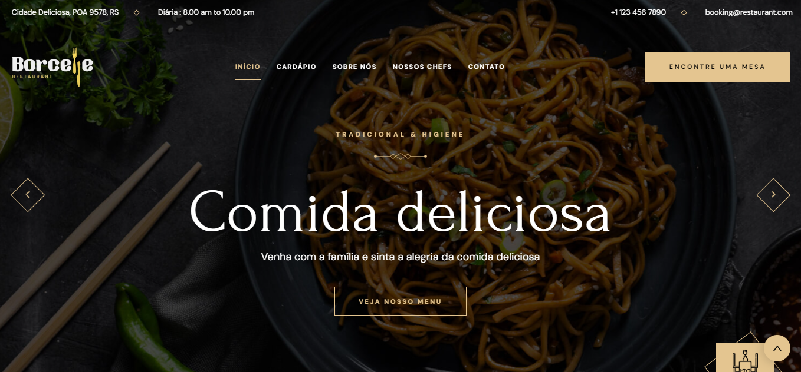
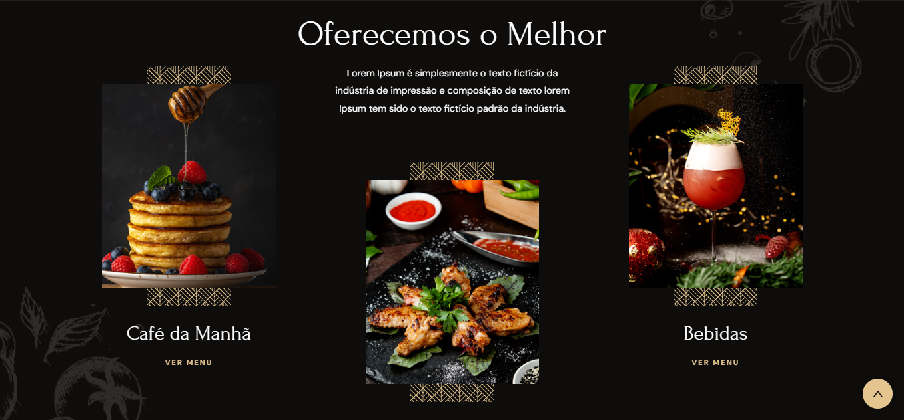
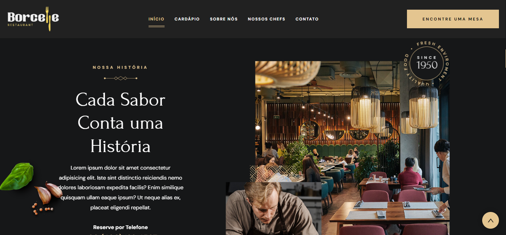
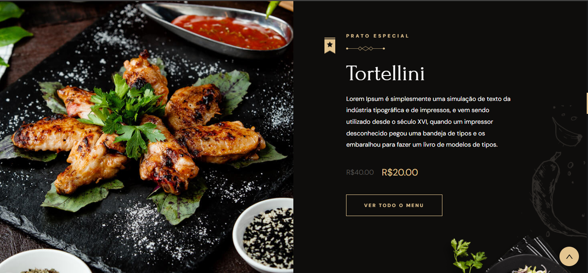

# Projeto de Treino CSS para Interface de Restaurante

Este projeto foi desenvolvido como parte do treinamento em CSS, focando na criação de uma interface atraente para um restaurante.

## Descrição do Projeto

✌️ O objetivo deste projeto é aplicar técnicas avançadas de CSS para criar uma interface visualmente atraente e responsiva para um site de restaurante. O layout deve ser moderno, intuitivo e agradável aos olhos dos usuários.

## Funcionalidades Implementadas

- Layout responsivo para diferentes tamanhos de tela (desktop, tablet, celular).
- Utilização de Flexbox e/ou Grid para o posicionamento dos elementos.
- Escolha cuidadosa de cores, fontes e espaçamentos para melhorar a usabilidade e a estética.
- Integração de imagens e ícones relevantes ao tema do restaurante.
- Menu interativo com transições suaves e efeitos visuais.

## Acesse

[www.restaurantBorcelle.com](https://restaurantborcelle.netlify.app/)

